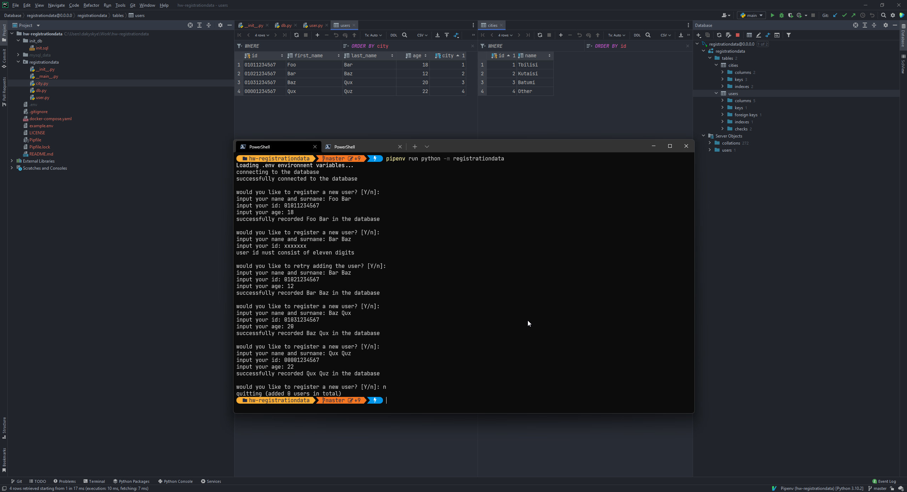

# Registrationdata

Registrationdata is a little overengineered simple homework I had at university.

## Caveats

* The application isn't fault-tolerant but it's not meant to be run in production either - just some simple homework of
  mine at uni.

## Running

* rename `example.env` to `.env`
* `docker compose up -d`
* `pipenv run python -m registrationdata`

